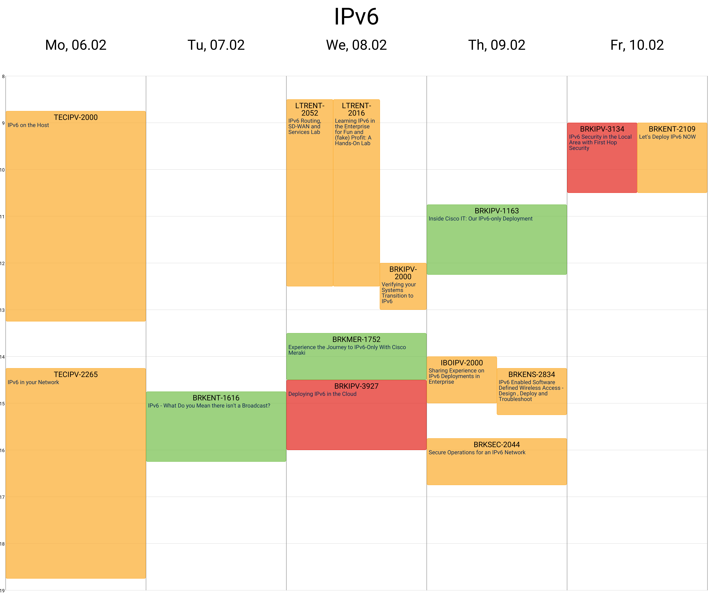

Generates Cisco Live Amsterdam 2023 Learning Maps based on the [Cisco Live Session Catalog](https://www.ciscolive.com/emea/learn/sessions/session-catalog.html?).

# Colour code in the agenda

Colour code is based on the level of the session.

- Green: Introduction session
- Orange: Intermediate session
- Red: Advanced session
- Blue: General session

# Setup

```
pip install -r requirements.txt
```

## Fixing the Calendar_View library

We encountered a few unexpected behavior with the Calendar_View library. 

You need to edit the `core/calendar_events.py` file.

Line 104 should be: `if i.start_time <= j.start_time < i.end_time \`

Line 156 should be: `cell_inner_size: tuple[int, int] = EventDrawHelper.count_cell_inner_size((x1, x2), y)`

# Usage

Run the Jupyter Notebook `learning_map_http.ipynb`.
The Learning Maps will be saved in `learning_maps` folder.

# Example


